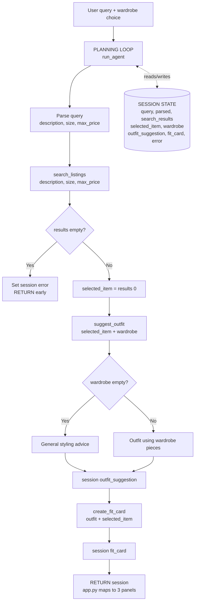

# FitFindr — planning.md

> Completed before implementation. This spec is what I'll hand to AI tools when
> generating each tool and the planning loop. Updated before any stretch feature.

---

## Tools

### Tool 1: search_listings

**What it does:**
Filters the 40-item mock listings dataset by an optional size and price ceiling, then ranks whatever survives by how well each listing's text matches the user's keywords. Returns the best matches first so the planning loop can pick the top one.

**Input parameters:**
- `description` (str): Free-text keywords describing the wanted item, e.g. `"vintage graphic tee"`. Used for keyword scoring, not exact matching.
- `size` (str | None): Size string to filter by. Matching is case-insensitive and loose (see failure note). `None` skips size filtering.
- `max_price` (float | None): Inclusive price ceiling. A listing at exactly this price passes. `None` skips price filtering.

**What it returns:**
A `list[dict]` of full listing dicts (each with `id`, `title`, `description`, `category`, `style_tags`, `size`, `condition`, `price`, `colors`, `brand`, `platform`), sorted by relevance score descending, with any zero-score listing removed. The dicts are returned unmodified — the relevance score is computed internally and not added to the output. Returns `[]` when nothing matches.

**How matching works (so the implementation is unambiguous):**
- Price: keep listings where `price <= max_price`.
- Size: normalize both sides to lowercase, strip parenthetical qualifiers like `(oversized)` / `(fits oversized)`, split on `/` and whitespace into tokens, and keep a listing if it shares a size token with the requested size. Listings whose size normalizes to `"one size"` match any requested size (they fit everyone).
- Relevance: lowercase-tokenize `description` (drop trivial words like `a`, `the`, `under`), build a searchable blob from `title + description + style_tags + category + colors`, and score each listing by how many query tokens appear in its blob (a match in `title` or `style_tags` is worth slightly more than one in `description`). Drop score 0, sort by score descending.

**What happens if it fails or returns nothing:**
Never raises. Returns `[]`. The planning loop detects the empty list, writes a helpful message into `session["error"]`, and stops before calling `suggest_outfit`. The agent never passes an empty result downstream.

---

### Tool 2: suggest_outfit

**What it does:**
Takes the selected thrifted item and the user's wardrobe and asks the LLM (Groq `llama-3.3-70b-versatile`) for 1–2 concrete outfit combinations that pair the new item with named pieces from the wardrobe, plus a sentence of styling detail per outfit.

**Input parameters:**
- `new_item` (dict): The listing dict chosen by the planning loop (the full search result, passed by reference — not re-entered).
- `wardrobe` (dict): A wardrobe dict shaped `{"items": [ {id, name, category, colors, style_tags, notes}, ... ]}`. May be empty (`{"items": []}`).

**What it returns:**
A non-empty `str` of outfit suggestions. When the wardrobe has items, the string names specific pieces from it. When the wardrobe is empty, the string is general styling advice for the item (what categories/colors pair well, what vibe it suits) rather than referencing nonexistent pieces.

**What happens if it fails or returns nothing:**
- Empty wardrobe (`wardrobe["items"]` is empty) → branch to a "general styling advice" prompt instead of the wardrobe prompt, so the tool still returns useful text. No crash.
- LLM/network exception → caught; returns a short safe fallback string (a generic styling suggestion for the item's category) so the agent stays usable instead of raising.

---

### Tool 3: create_fit_card

**What it does:**
Turns the outfit suggestion and item details into a short, casual, shareable caption — the kind of thing you'd post under an OOTD photo. Uses the LLM at a higher temperature so different inputs produce visibly different captions.

**Input parameters:**
- `outfit` (str): The outfit suggestion string returned by `suggest_outfit`.
- `new_item` (dict): The listing dict for the thrifted item (used to mention name, price, and platform).

**What it returns:**
A 2–4 sentence `str` usable as an Instagram/TikTok caption. It mentions the item name, price, and platform once each, captures the outfit's vibe in specific terms, and reads casual (not like a product description).

**What happens if it fails or returns nothing:**
- `outfit` empty or whitespace-only → returns a descriptive error string (e.g. `"Couldn't write a fit card — no outfit was provided."`) rather than raising. This is the guard the planning loop relies on.
- LLM/network exception → caught; returns a short safe fallback caption built from the item fields so the panel is never blank.

---

### Additional Tools (if any)

None for the required build. If I add the **price comparison** stretch tool, it will be `compare_price(new_item)` → returns a verdict string (`"fair" / "high" / "great deal"`) plus the median price of same-category listings, called by the planning loop after `search_listings` and before `suggest_outfit`. I'll fill in a full block here before starting it.

---

## Planning Loop

The loop is a **guarded sequential pipeline**: each step runs only if the previous step left usable state in the session, and the search step can short-circuit the entire plan. It is not a fixed three-call sequence — for a no-match query, only `search_listings` runs.

Step-by-step conditional logic:

1. **Initialize** the session with `_new_session(query, wardrobe)`.
2. **Parse** the raw query into `description`, `size`, `max_price` using regex/keyword extraction (price from patterns like `under $30` / `$30` / `less than 30`; size from `size M` or standalone size tokens like `M`, `8`, `W30`; `description` = the query with the matched price/size phrases stripped out so search keywords stay clean). Store under `session["parsed"]`.
3. **Search:** call `search_listings(description, size, max_price)`; store in `session["search_results"]`.
   - **Branch:** if `search_results` is empty → set `session["error"]` to a message that names what to loosen (size / budget / keywords) and **`return session` early.** Do not proceed.
   - Else continue.
4. **Select:** `session["selected_item"] = search_results[0]` (top-ranked match).
5. **Suggest:** call `suggest_outfit(selected_item, wardrobe)`; store in `session["outfit_suggestion"]`. (This tool internally branches on empty wardrobe; the loop doesn't need to special-case it.)
6. **Fit card:** call `create_fit_card(outfit_suggestion, selected_item)`; store in `session["fit_card"]`.
7. **Return** the completed session.

The agent is "done" when it either hits the early-return branch (error set, downstream fields stay `None`) or completes step 6 (`fit_card` populated, `error` is `None`).

---

## State Management

A single `session` dict is the source of truth for one interaction. Created by `_new_session()`, it holds:

- `query` — original user text
- `parsed` — `{description, size, max_price}` from step 2
- `search_results` — list returned by `search_listings`
- `selected_item` — the exact dict `search_results[0]`, passed by reference into `suggest_outfit`
- `wardrobe` — the wardrobe dict passed in at the start
- `outfit_suggestion` — string from `suggest_outfit`, passed into `create_fit_card`
- `fit_card` — string from `create_fit_card`
- `error` — `None` unless the loop terminated early

Each tool reads its inputs from the session and the loop writes each return value back into the session before the next step. Because `selected_item` is the same dict object produced by search, and `outfit_suggestion` is reused verbatim by the fit-card step, nothing is re-entered or re-searched between tools. On early termination, `error` is set and `outfit_suggestion` / `fit_card` remain `None`, which is how `app.py` knows to show only the error.

---

## Error Handling

| Tool | Failure mode | Agent response |
|------|-------------|----------------|
| search_listings | No results match the query | Tool returns `[]`. Loop sets `session["error"]`: e.g. *"No listings matched 'vintage graphic tee' (size M, under $30). Try removing the size filter, raising your budget, or using broader keywords like 'graphic tee'."* Loop returns early; `suggest_outfit` is never called. |
| suggest_outfit | Wardrobe is empty | Tool detects `wardrobe["items"] == []` and switches to a general-styling-advice prompt, returning what kinds of pieces and colors pair well with the item and the vibe it suits — a useful non-empty string instead of an error. |
| create_fit_card | Outfit input is missing or incomplete | Tool guards against an empty/whitespace `outfit` and returns a descriptive error string (*"Couldn't write a fit card — no outfit was provided."*) rather than raising. |

Additional robustness (not required, but implemented): both LLM tools wrap their Groq call in try/except and return a short fallback string on any API/network exception, so a transient failure degrades gracefully instead of crashing the run.

---

## Architecture

Error branch: the only early termination is the empty-search branch, which sets `session["error"]` and returns before `suggest_outfit`. Every other failure is handled inside a tool and still returns a usable string, so the loop continues.

---

## AI Tool Plan

**Milestone 3 — Individual tool implementations:**

For each tool I'll write the core logic myself first, then use Claude to check my implementation against the spec and catch edge cases I may have missed.

- `search_listings`: I'll write the filtering and scoring logic myself — price and size filtering are straightforward conditionals, and the keyword scoring is a loop over tokens. Once I have a working draft I'll ask Claude to review whether the size normalization handles cases like `"S/M"` and `"XL (oversized)"` correctly. I'll test it manually with 3 queries before trusting any suggested changes: a normal match, a size-filtered match, and the impossible `"designer ballgown / XXS / $5"` no-results case.

- `suggest_outfit`: I'll write the branching logic and the prompt myself — the empty-wardrobe check is a simple `if`, and I know what I want the LLM to produce. I'll ask Claude to review my Groq API call syntax if I get stuck on the SDK, not to write the whole function. I'll verify by running it once with `get_example_wardrobe()` (output should name actual wardrobe pieces) and once with `get_empty_wardrobe()` (should give general advice, not crash).

- `create_fit_card`: I'll write the prompt and the empty-string guard myself. If the captions come out sounding too formal or repetitive, I'll ask Claude for suggestions on prompt phrasing to make them more casual and varied. I'll run the same input 3 times to confirm variability before moving on.

**Milestone 4 — Planning loop and state management:**

I'll implement `run_agent()` myself following the numbered steps in the Planning Loop section above — the logic is a straight sequence of calls with one branch, which I can write directly. I'll use Claude to sanity-check that my session dict is being updated correctly at each step (i.e. that `selected_item` is the actual dict from search results, not a copy or re-query). If the regex query parser mis-handles an edge case I'll ask Claude for a fix to that specific pattern rather than rewriting the whole parser. I'll verify the branch works by printing `session` at the end of both a happy-path run and a no-results run before wiring it into `app.py`.

---

## A Complete Interaction (Step by Step)

**What FitFindr needs to do (2–3 sentences):** FitFindr takes a natural-language thrifting request and runs it through a planning loop that calls three tools in order. The user's query triggers `search_listings` (parsed into description / size / max_price); the top match flows into `suggest_outfit`, which styles it against the user's wardrobe; and that outfit flows into `create_fit_card`, which writes a shareable caption. If `search_listings` finds nothing the agent stops and tells the user what to loosen rather than passing empty input downstream; if the wardrobe is empty `suggest_outfit` falls back to general styling advice; and if the outfit string is missing `create_fit_card` returns an error message instead of crashing.

**Example user query:** "I'm looking for a vintage graphic tee under $30. I mostly wear baggy jeans and chunky sneakers. What's out there and how would I style it?"

**Step 1 — Parse + search.** The loop parses the query into `description="vintage graphic tee"`, `size=None`, `max_price=30.0`, and calls `search_listings("vintage graphic tee", None, 30.0)`. It returns the graphic-tee listings under $30 sorted by relevance (e.g. the `lst_006` bootleg-style tee at $24 scores highly on `graphic tee` + `vintage`). `session["search_results"]` is non-empty.

**Step 2 — Select + suggest.** `session["selected_item"] = search_results[0]` (the $24 tee). The loop calls `suggest_outfit(selected_item, example_wardrobe)`, which pairs the tee with named wardrobe pieces — e.g. the baggy straight-leg jeans (`w_001`) and chunky white sneakers (`w_007`) — and returns a styling string. Stored in `session["outfit_suggestion"]`.

**Step 3 — Fit card.** The loop calls `create_fit_card(outfit_suggestion, selected_item)`, producing a casual caption that names the tee, its $24 price, and the platform once each. Stored in `session["fit_card"]`.

**Final output to user:** Three panels — the top listing (title, price, condition, platform), the outfit suggestion naming their own pieces, and the shareable fit-card caption. `session["error"]` is `None`.

**Error path (same query but impossible):** "designer ballgown size XXS under $5" → `search_listings` returns `[]` → loop sets `session["error"]` with a loosen-your-filters message and returns. The outfit and fit-card panels stay empty; only the error shows.
